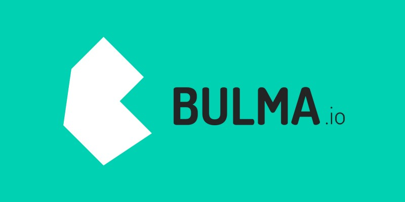

# Framework Bulma CSS

_April 2021_

> 🔨 From Udemy [Maîtrisez le Framework Bulma - Enzo Ustariz](https://www.udemy.com/course/maitrisez-le-framework-bulma).

---

Bulma is a free, open source framework that provides ready-to-use frontend components that you can easily combine to build responsive web interfaces.

<h1 align="center">
    
</h1>

## Overview

### 1.Modifiers

Most Bulma elements have alternative styles. To apply them, you only need to append one of the modifier classes. They all start with is- or has-.

- 1.1 Typography
- 1.2 Colours
- 1.3 Helpers
- 1.4 Display Responsive

### 2.Grids

- 2.1 Base and size
- 2.2 Responsive
- 2.3 Gap
- 2.4 Alignment

### 3.Layout

- 3.1 Containers and levels
- 3.2 Media and hero
- 3.3 Section and footer
- 3.4 Thread

### 4.Forms

- 4.1 Inputsand textarea
- 4.2 Select and checkbox
- 4.3 Radio and files

### 5.Elements

- 5.1 Box and buttons
- 5.2 Content and icons
- 5.3 Images, noyifications and tags
- 5.4 Progress bars and tables

### 6.Components

- 6.1 Crumbtrail and cards
- 6.2 Dropdown menu
- 6.3 Message and modals
- 6.4 Navigation and pagination
- 6.5 Tabs

### 7.Custom classes

With node-sass.

```batch
npm init
```

This will launch an interactive setup to create package.json. When prompted for an entry point, enter **sass/mystyles.scss**.

```batch
npm install node-sass --save-dev
npm install bulma --save-dev
```

Create a **sass** folder in which you add a file called **mystyles.scss**:

```scss
@charset "utf-8";
@import "../node_modules/bulma/bulma.sass";
```

Create a html page including:

```html
<link rel="stylesheet" href="css/mystyles.css" />
```

Add scripts in **package.json**:

```json
"scripts": {
  "css-build": "node-sass --omit-source-map-url sass/mystyles.scss css/mystyles.css",
  "css-watch": "npm run css-build -- --watch",
  "start": "npm run css-watch"
}
```

To test: `npm run css-build`

=>

```
Rendering Complete, saving .css file...
Wrote CSS to ./../css/mystyles.css
```

This css file contains all Bulma css settings. We can add classes in **sass/mystyles.scss** then rerun build command to add these new classes.

```scss
$size-1: 250px;
@import "../node_modules/bulma/bulma.sass";
```

```html
<p class="is-size-1">Lorem ipsum dolor sit amet consectetur.</p>
```

`npm run css-build`

List of all variables that can be customized: [https://bulma.io/documentation/customize/variables/](https://bulma.io/documentation/customize/variables/)

## Useful links

- [Bulma: the modernCSS framework thatjust works.](https://bulma.io/)
- [Bulma: Customize](https://bulma.io/documentation/customize/)
- [Ziratsu/Bac_a_Sable_depart](https://github.com/Ziratsu/Bac_a_Sable_depart)
